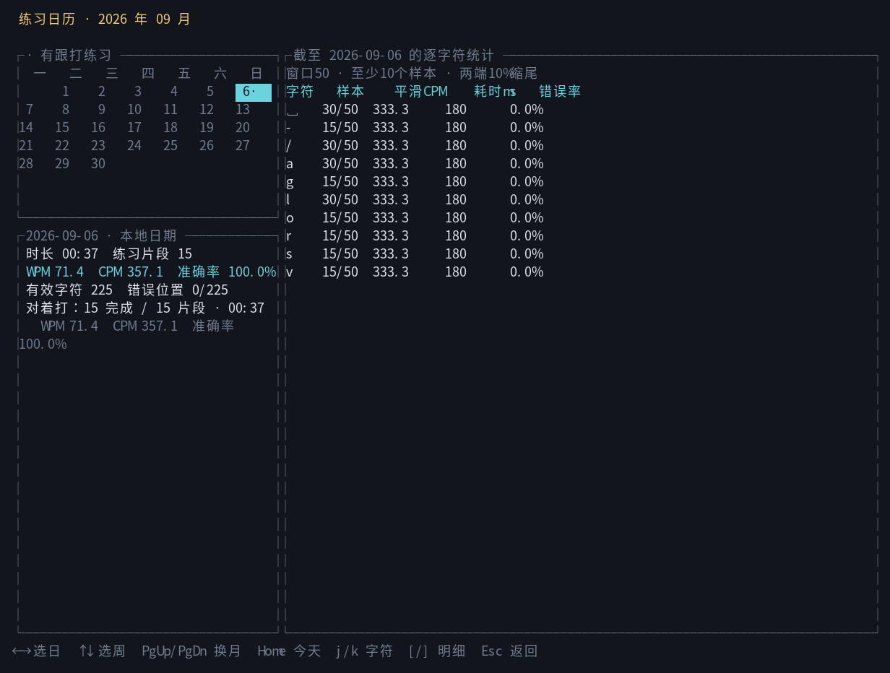
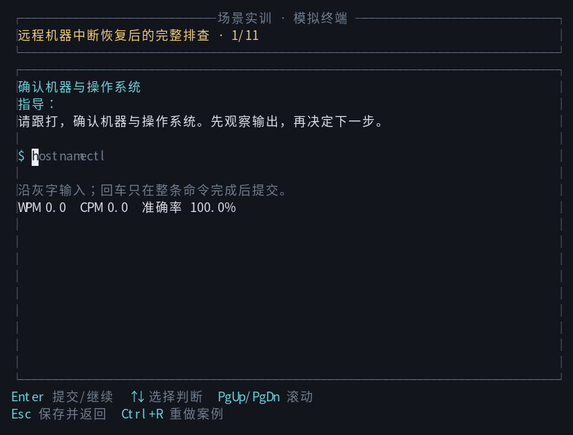

# cmdtyper

> Linux 命令行交互式教学系统 — 终端模拟打字 · 体系化学习 · 分级训练 · 深度解析

**cmdtyper** 是一个基于 Rust 的终端 TUI 应用，面向 Linux 初学者到中级用户，提供命令跟打、词元填空、独立默写、专题讲解与统计追踪。它只比较用户输入并展示 TOML 中的预设内容，**不会执行任何真实命令，也不会把输入交给 shell**。

## v0.4 特性总览

- **三档打字显示**：Terminal / Standard / Detailed，按 `F2` 切换
- **分级筛选**：按难度（Beginner / Basic / Advanced / Practical）与类别过滤命令
- **53 个数据驱动专题**：从求助自救、APT、压缩、权限一路覆盖到终端会话恢复
- **三档专题训练**：L1 完整输入、L3 单词元填空、L5 独立默写
- **模拟输出反馈**：完成输入后展示预设终端输出，建立“命令 → 结果”映射
- **命令深度讲解**：课程包含语法、选项、示例、词元解释与易错点
- **符号与系统专题**：练习 Shell 符号，并理解终端、权限、存储、网络、Locale 等系统概念
- **统计面板**：记录 WPM、准确率、字符分析、类别掌握度与连续练习天数
- **严格安全边界**：纯数据驱动，运行时没有 shell 或进程执行路径

## 内容库（v0.4）

| 类别 | 数量 | 内容 |
|---|---:|---|
| 命令题库 | **2467 条 / 110 个文件** | 统一规范命令；各模块通过 ID 引用 |
| 数据驱动命令专题 | **53 个** | 新增 24 个网络排障专题及常见运维专题 |
| 命令讲解 | **75 课** | 31 课既有内容 + 44 课专题扩充；语法、选项、示例、词元与易错点 |
| Lesson 链接覆盖 | **469/469 示例** | 所有讲解示例均引用规范命令，保留各自教学上下文 |
| 符号专题 | **8 个专题 / 120 题** | 管道、重定向、引用、变量、正则、条件测试、分组与展开等 |
| 系统架构专题 | **11 个专题 / 52 节** | 目录、权限、进程、网络、包管理、标准流、存储、会话、Locale 等 |

## 逐条输入、基础三题与场景实训

原有 40 条长操作流程（216 步）改为逐条回车：输入当前命令后展示本步模拟输出及说明，再继续下一条，保留此前变量和目录上下文。`&&` 条件执行、引号和子 Shell 等专门教学例子按原语义保留。`F2` 切换显示、`F3` 切换提示，普通 `m`、`h` 始终属于输入字符；输出出现后直接输入下一条的首字符也不会丢键。多行默写可用 `Shift+Enter` 换行。

基础练习有 **281 个用法组**，每组一个教学示例和三道简单题，共 **843 个练习位置、690 道独立题**。专题详情按 `P` 进入对应三题训练，也可以从学习中心浏览全部基础用法。重复题目共享 ID 与进度，专题显示实际练习数量。全部用法的核心能力和三题对应理由见[逐组语义复核](docs/foundation_semantic_review_20260906.md)。

“场景实训”提供 **20 个案例、245 个步骤、41 个诊断判断点**，包括中断恢复、SSH/DNS/端口/链路排查、抓包、网站部署、版本回滚、数据库事务修改、备份恢复、OOM 和服务故障。网站案例采用 Docker Compose、Nginx、FastAPI、PostgreSQL 和 Git。灰字跟打后阅读模拟输出、解释证据，再做判断；可退出续练或重做。SQL 语句显示数据库提示符，区分终端上下文。

## 练习日历与字符速度

首页“练习日历”统计所有完整跟打入口的每日有效时长、WPM、CPM、准确率；阅读、填空、默写和诊断选择不进入跟打指标。退出、跳过和重练会保存已练部分。同一目标位置无论误按多少次都只记一个错误，退格不会清除错误。

每个字符独立保留最近 **50 个**有效耗时；不足 **10 个**显示样本不足，达到门槛后对两端各 **10%** 缩尾，再由平均耗时换算 CPM。首次输入、跨暂停、超过 30 秒空闲以及零耗时样本不用于字符速度估计。日历支持日期与月份选择、入口明细和截至所选日期的字符窗口。

远程运行的日期以进程时区为准；下方的源码启动示例显式选择上海时区，不修改主机时区。旧记录自动备份迁移，无法恢复的旧击键细节不补造。保存失败会显示错误，并保留当前练习以便重试。

详细说明：[统计口径与兼容](docs/statistics.md)、[题库来源与审计](docs/content_sources_20260906.md)、[实训案例审计](docs/scenario_content_audit.md)。

## 界面与验收





[逐条回车界面](docs/validation/workflow-80x24.png)、[40×10 紧凑日历](docs/validation/calendar-40x10.png)、[验收记录与终端录像](docs/validation_20260906.md)、[需求验收对应](docs/v0.4-acceptance-matrix.md)。窗口低于 20 行时，日历优先显示所选日期指标，方向键和月份切换仍可使用。

## 训练与学习模式

### 三档打字显示

在对着打界面中，可按 `F2` 轮换：

1. **Terminal**：更接近真实终端的紧凑显示
2. **Standard**：默认显示，兼顾输入与解释
3. **Detailed**：展示更多词元说明

模式顺序为 `Standard → Detailed → Terminal → Standard`。正在输入命令时，普通字母 `m` 会作为命令字符处理，不会抢占输入。

### 分级筛选

支持两个维度：

- **Difficulty**：Beginner / Basic / Advanced / Practical
- **Category**：FileOps / Permission / TextProcess / Search / Process / Network / Archive / System / Pipeline / Scripting

可单独或组合筛选。推荐从 Beginner + FileOps 开始，再进入 Basic 的文本、搜索与系统类练习。

### 专题训练：当前实现为 L1 / L3 / L5

学习中心的“专题训练”入口列出 53 个命令专题。每次会从当前专题中优先选择练习次数较少的命令，单轮最多 10 题，并可用 `←` / `→` 或 `h` / `l` 选择级别：

- **L1 完整输入**：屏幕显示完整命令，用户逐字符输入整条命令；记录准确率与 WPM，完成后显示预设模拟输出。
- **L3 单词元填空**：保留命令骨架，只遮住一个关键 token；用户只输入缺失词元，答案严格区分大小写。
- **L5 独立默写**：只显示中文任务提示，用户独立输入完整命令；使用命令自带的合法答案集合判定。首尾及未引用的分隔空白可规范化，但引号内或反斜杠转义的空白保持严格区分。

当前版本**没有实现 L2 渐隐跟打、L4 分层提示默写，也没有间隔重复或到期调度**。专题训练不会被描述成尚未存在的五级自动进阶系统。

### 命令专题讲解

命令学习课程通常包含：

1. **Overview**：用途、语法骨架、常见选项与注意事项
2. **Examples**：关联主命令库的示例、词元解释与预设输出
3. **Practice**：逐字符输入示例命令并记录结果

课程、符号和系统内容可通过 `command_id` 引用主命令库；加载时会补全规范命令、提示、答案、token 和模拟输出，避免多处复制后产生漂移。

### 符号专题

符号专题覆盖：

- 管道与重定向
- 通配符、引号与转义
- Shell 变量与特殊字符
- 正则表达式
- 条件测试与 `&&` / `||`
- 子 Shell、当前 Shell 分组、命令替换、参数展开与花括号展开

练习包含跟打与默写两类，所有结果仍来自静态题库。

### 系统架构专题

系统专题用概念说明、静态命令示例和预设输出解释目录结构、权限、进程、网络、包管理、标准流、存储、登录会话与 Locale。它们用于建立系统心智模型，不会读取或修改真实系统状态。

### 终端会话恢复：tmux 与 reptyr

“终端会话与任务接管”专题讲解两条恢复路径：

- **优先使用 tmux**：先列出会话、窗口和窗格，核对 PID、TTY 与当前命令，再连接或分离客户端；`kill-session` 被明确标为破坏性动作。
- **谨慎评估 reptyr**：先用 `tty`、`ps`、`command -v reptyr` 和只读 `ptrace_scope` 检查确认用户、PID、PPID、SID、TTY、命令行与内核策略，再考虑普通 `reptyr PID`。

本专题**有意排除可执行的 `reptyr -T` 练习**。该模式影响整条 TTY，而不只是单个 PID，不能被当作普通模式失败后的升级路径，也不能用于绕过 Yama、权限或所有权边界。文档只说明其风险，并要求先用只读进程清单评估影响范围。

### 独立默写

独立默写模式只给中文描述，支持：

- 命令定义中明确列出的多种合法答案
- 首尾空白与连续空白归一化
- Linux 命令、选项、变量和路径的大小写敏感判定
- 错误时显示最接近答案与字符差异

## 学习中心

```text
学习中心
├── 命令专题
├── 符号专题
├── 系统架构
├── 专题训练
├── 基础用法练习
└── 场景实训
```

## 快速开始

### 从源码构建

本项目最低需要 **Rust 1.88+**。

```bash
git clone https://github.com/ZhaoLingSun/cmdtyper.git
cd cmdtyper
cargo build --release
TZ=Asia/Shanghai CMDTYPER_DATA_DIR=./data ./target/release/cmdtyper
```

显式设置 `CMDTYPER_DATA_DIR=./data` 可确保源码检出的二进制使用当前仓库数据，不会被已安装的旧数据目录覆盖。

### 安装到当前用户

```bash
./scripts/install.sh
~/.local/bin/cmdtyper
```

安装脚本会同时安装 release 二进制、`commands`、`lessons`、`symbols`、`system`、`practice`、`scenarios`、`sequences` 数据目录以及命令别名和提示符元数据；运行时不会依赖仓库当前目录。

### Docker 运行

```bash
docker compose build
docker compose run --rm cmdtyper
```

Docker 镜像同样只打包已发布的数据目录，并把用户进度写入 `/userdata` 卷。

### 依赖

- Rust **1.88+**（edition 2024）
- 支持 256 色的终端

## 快捷键（按界面）

| 按键 | 操作 |
|---|---|
| `↑` `↓` / `j` `k` | 菜单上下移动 |
| `Enter` | 确认进入、提交答案或继续下一项 |
| `→` / `l` | 下一步；专题训练摘要页切到更高训练级别 |
| `←` / `h` | 返回或反向切换；专题训练摘要页切到更低训练级别 |
| `Tab` | 对着打跳过当前命令；统计页切换标签 |
| `Shift+Tab` | 统计页切换到上一个标签 |
| `F2` | 对着打中切换 Terminal / Standard / Detailed |
| `D` | 在支持页面打开或关闭深度解析 |
| `F3` | 对着打中切换词元提示 |
| `Ctrl+R` | 重练当前命令 |
| `Backspace` | 编辑填空或默写输入 |
| `Esc` | 返回上一级 |
| `q` | 仅主页退出 |
| `Ctrl+C` | 全局退出 |

## 项目结构

```text
src/
├── main.rs
├── app.rs
├── event.rs
├── core/
├── data/
├── flow/
└── ui/

data/
├── commands/
├── lessons/
├── symbols/
├── system/
├── practice/
├── scenarios/
├── sequences/
├── command_aliases.toml
└── command_contexts.toml
```

## 技术栈

| 组件 | 技术 |
|---|---|
| 语言 | Rust（edition 2024，Rust 1.88+） |
| TUI | ratatui 0.29 + crossterm 0.28 |
| 数据 | TOML（课程）+ JSON（进度） |
| 容器 | Docker multi-stage build |

## 安全边界

**cmdtyper 不执行任何真实命令。**

- 用户输入只进入打字引擎或字符串匹配器；
- “终端输出”全部来自 TOML 预设内容；
- 应用不把命令交给 shell，不启动子进程，也不通过执行结果判题；
- 即使教材展示 `rm`、`sudo`、`tmux kill-session` 或 `reptyr`，也只是静态学习内容。

## License

MIT
